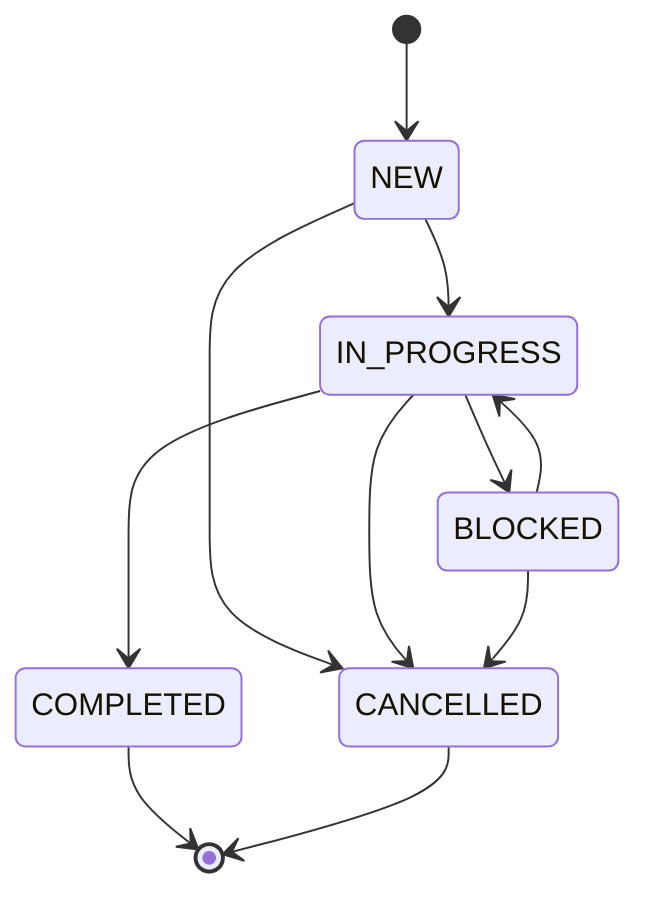
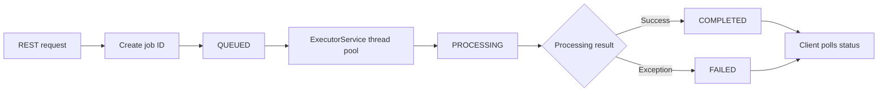
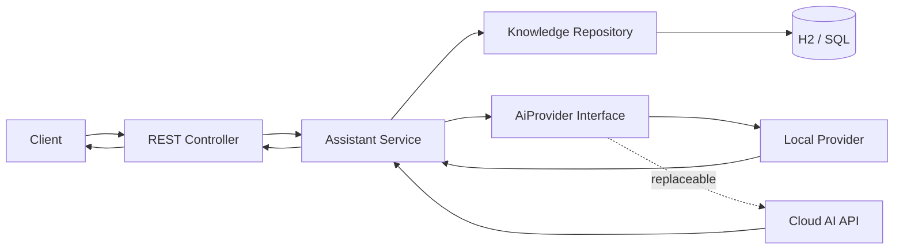
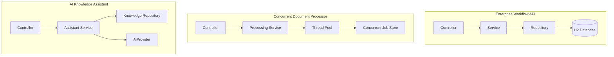

<div align="center">

# ☕ Java Product Engineering Portfolio

### Spring Boot · REST APIs · SQL · Multithreading · Microservices · AI Integration


**Three backend projects demonstrating the core skills expected from an entry-level Java Product Engineer.**

[Explore Projects](#-projects) · [Architecture](#%EF%B8%8F-portfolio-architecture) · [Run Locally](#-run-locally) · [API Guide](#-api-quick-reference) · [Interview Guide](INTERVIEW_GUIDE.md)

</div>

---

## 👋 About This Portfolio

This repository contains three independent Java 17 and Spring Boot applications designed around enterprise product-engineering responsibilities:

- Developing and maintaining backend modules
- Creating REST APIs
- Applying object-oriented design
- Working with SQL and relational persistence
- Handling validation and application errors
- Processing work concurrently
- Writing automated tests
- Packaging services with Maven and Docker
- Designing microservices that can integrate with AI APIs

Each project can be opened, built, tested, and run independently.

---

## 🚀 Projects

### 1. 📋 [Enterprise Workflow API](enterprise-workflow-api/)

An enterprise task-management backend that creates work items and moves them through a controlled state machine.

#### Key capabilities

- Create and retrieve enterprise work items
- Filter work by status
- Assign priority and ownership
- Enforce valid status transitions
- Reject invalid workflow changes
- Persist records using Spring Data JPA and H2
- Return consistent REST error responses

#### Workflow



#### Skills demonstrated

`Core Java` · `OOP` · `Enums` · `Collections` · `Exception Handling` · `Spring Boot` · `REST` · `JPA` · `SQL` · `Validation` · `JUnit`

<details>
<summary><strong>Example request</strong></summary>

```bash
curl -X POST http://localhost:8080/api/work-items \
  -H "Content-Type: application/json" \
  -d '{
    "title": "Validate enterprise customer request",
    "priority": "HIGH",
    "assignee": "Shil"
  }'
```

</details>

---

### 2. ⚙️ [Concurrent Document Processor](concurrent-document-processor/)

An asynchronous backend service that accepts document-processing jobs, processes them on a thread pool, and exposes job-status polling through REST.

#### Key capabilities

- Submit document-processing jobs
- Return immediately with an accepted job ID
- Process multiple jobs concurrently
- Store job state safely across threads
- Poll individual job status
- List all submitted jobs
- Handle interruptions and failures
- Shut down the executor gracefully

#### Processing lifecycle



#### Concurrency choices

| Component | Purpose |
|---|---|
| `ExecutorService` | Controls the worker-thread pool |
| `CompletableFuture` | Runs jobs asynchronously |
| `ConcurrentHashMap` | Stores jobs safely across threads |
| `AtomicReference` | Updates job status atomically |
| `volatile` | Makes processing results visible across threads |

#### Skills demonstrated

`Multithreading` · `Collections` · `ExecutorService` · `CompletableFuture` · `ConcurrentHashMap` · `Atomic State` · `REST` · `Exception Handling` · `JUnit`

<details>
<summary><strong>Example request</strong></summary>

```bash
curl -X POST http://localhost:8080/api/document-jobs \
  -H "Content-Type: application/json" \
  -d '{"fileName":"invoice.pdf"}'
```

</details>

---

### 3. 🤖 [AI Knowledge Assistant](ai-knowledge-assistant/)

An AI-ready knowledge microservice that stores articles, retrieves relevant context, and generates answers through a replaceable provider interface.

#### Key capabilities

- Add knowledge-base articles through REST
- Store articles using JPA and H2
- Search titles and content for relevant context
- Return source article IDs with generated answers
- Separate business logic from the AI provider
- Run without a paid API using the included local provider
- Support a future OpenAI, Azure OpenAI, Gemini, or other provider adapter

#### Architecture



#### Design advantage

The application depends on the `AiProvider` interface rather than a specific AI vendor. This demonstrates dependency inversion and makes the external AI integration replaceable and testable.

#### Skills demonstrated

`Java Interfaces` · `Dependency Injection` · `Spring Boot` · `REST` · `JPA` · `SQL` · `Microservices` · `AI API Design` · `Validation` · `JUnit` · `Docker`

<details>
<summary><strong>Example requests</strong></summary>

```bash
curl -X POST http://localhost:8080/api/articles \
  -H "Content-Type: application/json" \
  -d '{
    "title": "Password reset",
    "content": "Use the enterprise self-service portal."
  }'

curl -X POST http://localhost:8080/api/assistant/ask \
  -H "Content-Type: application/json" \
  -d '{"question":"Password reset"}'
```

</details>

---

## 🏗️ Portfolio Architecture



---

## 🧰 Technology Stack

| Category | Technologies |
|---|---|
| Language | Java 17 |
| Framework | Spring Boot 3.3 |
| Web | Spring Web, REST APIs, JSON |
| Persistence | Spring Data JPA, H2, SQL |
| Validation | Jakarta Bean Validation |
| Concurrency | ExecutorService, CompletableFuture, ConcurrentHashMap, AtomicReference |
| Testing | JUnit 5, Spring Boot Test |
| Build | Maven |
| Containers | Docker |
| Architecture | Layered architecture, microservices, dependency inversion |

---

## 📁 Repository Structure

```text
Java_Developer_Portfolio/
│
├── README.md
├── INTERVIEW_GUIDE.md
├── .gitignore
│
├── enterprise-workflow-api/
│   ├── pom.xml
│   ├── Dockerfile
│   ├── README.md
│   └── src/
│       ├── main/
│       └── test/
│
├── concurrent-document-processor/
│   ├── pom.xml
│   ├── Dockerfile
│   ├── README.md
│   └── src/
│       ├── main/
│       └── test/
│
└── ai-knowledge-assistant/
    ├── pom.xml
    ├── Dockerfile
    ├── README.md
    └── src/
        ├── main/
        └── test/
```

---

## 💻 Prerequisites

Install the following before running the projects:

- JDK 17 or later
- Maven 3.9 or later
- Git
- Docker Desktop (optional)

Verify the installation:

```bash
java -version
mvn -version
git --version
docker --version
```

---

## ▶️ Run Locally

Clone the repository:

```bash
git clone https://github.com/YOUR-USERNAME/YOUR-REPOSITORY.git
cd YOUR-REPOSITORY
```

Choose one project:

```bash
cd enterprise-workflow-api
```

Build and test it:

```bash
mvn clean verify
```

Start the application:

```bash
mvn spring-boot:run
```

The selected application will be available at:

```text
http://localhost:8080
```

> Run only one project at a time unless you configure different server ports.

---

## 🐳 Run with Docker

Build the JAR first:

```bash
mvn clean package
```

Build and run the image:

```bash
docker build -t java-portfolio-service .
docker run --rm -p 8080:8080 java-portfolio-service
```

---

## 🔌 API Quick Reference

### Enterprise Workflow API

| Method | Endpoint | Purpose |
|---|---|---|
| `POST` | `/api/work-items` | Create a work item |
| `GET` | `/api/work-items` | List all work items |
| `GET` | `/api/work-items?status=NEW` | Filter work items by status |
| `PATCH` | `/api/work-items/{id}/status` | Transition a work item |

### Concurrent Document Processor

| Method | Endpoint | Purpose |
|---|---|---|
| `POST` | `/api/document-jobs` | Submit an asynchronous job |
| `GET` | `/api/document-jobs` | List submitted jobs |
| `GET` | `/api/document-jobs/{id}` | Poll a specific job |

### AI Knowledge Assistant

| Method | Endpoint | Purpose |
|---|---|---|
| `POST` | `/api/articles` | Add a knowledge article |
| `POST` | `/api/assistant/ask` | Ask a question using retrieved context |

---

## 🧪 Testing

Run the tests inside any project folder:

```bash
mvn test
```

Current tests demonstrate:

- Valid and invalid workflow transitions
- Asynchronous job submission and storage
- AI-provider output using retrieved context

Recommended extensions:

- Controller tests with MockMvc
- Repository integration tests
- Concurrency stress tests
- Testcontainers for a production-style SQL database
- Contract tests for an external AI provider

---

## 🎯 Job Description Alignment

| Expected skill | Portfolio evidence |
|---|---|
| Core Java and OOP | Domain models, services, interfaces, enums, controlled behavior |
| Collections | Sets, lists, maps, immutable copies, concurrent collections |
| Exception handling | Domain errors, REST advice, interruption and failure handling |
| Multithreading | ExecutorService, CompletableFuture, atomic and concurrent state |
| Spring/Spring Boot | Three independent Spring Boot applications |
| REST APIs | Controllers, JSON requests, validation, HTTP status codes |
| SQL/databases | Spring Data JPA and H2 relational persistence |
| Maven | Independent Maven configuration for every project |
| Git | Repository-ready structure and `.gitignore` |
| Testing | JUnit tests in every project |
| Microservices | Independent deployable services with clear responsibilities |
| Docker/cloud readiness | Dockerfiles using Eclipse Temurin Java 17 |
| AI/LLM exposure | Replaceable AI-provider abstraction and context retrieval |

---

## 🗣️ Interview Talking Points

<details>
<summary><strong>Why use a state machine in the workflow API?</strong></summary>

It keeps business rules inside the domain model and prevents invalid transitions such as moving directly from `NEW` to `COMPLETED`.

</details>

<details>
<summary><strong>How is the document processor thread-safe?</strong></summary>

It stores jobs in a `ConcurrentHashMap`, keeps status in an `AtomicReference`, exposes immutable snapshots, and uses a fixed executor instead of creating uncontrolled threads.

</details>

<details>
<summary><strong>How would you connect a real LLM?</strong></summary>

Create another implementation of `AiProvider`, call the external API through an HTTP client, map its response, configure credentials through environment variables, and keep the controller and business service unchanged.

</details>

<details>
<summary><strong>What would you improve for production?</strong></summary>

Add PostgreSQL, database migrations, authentication, OpenAPI documentation, structured logging, metrics, retry and timeout policies, Testcontainers, CI/CD, Kubernetes manifests, and cloud secret management.

</details>

---

## 🛣️ Future Enhancements

- PostgreSQL and Flyway database migrations
- Swagger/OpenAPI documentation
- Spring Security with JWT
- Resilience4j retries and circuit breakers
- Kafka or RabbitMQ for document jobs
- Real cloud AI-provider adapter
- Docker Compose and Kubernetes manifests
- GitHub Actions CI pipeline
- AWS, Azure, or GCP deployment

---

## ⚠️ Project Notice

These projects are educational portfolio applications built with fictional data. They are not production systems and are not affiliated with AutomationEdge or another employer.

<div align="center">

### Built to demonstrate Java fundamentals, backend engineering, and practical product-development skills.

</div>
